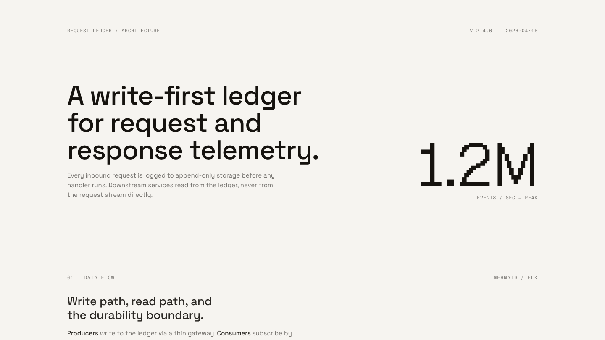
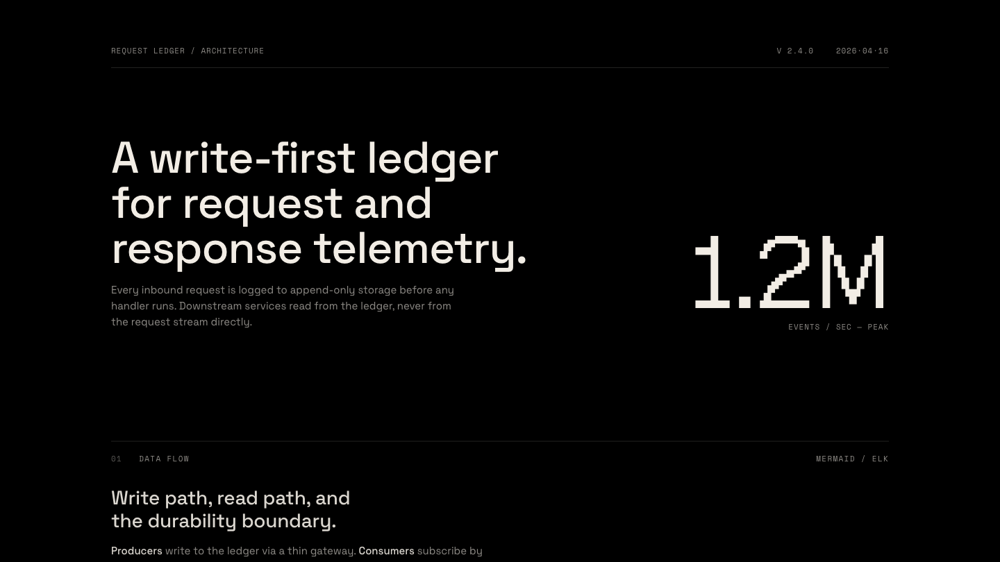

<p>
  
</p>

# visual-explainer-custom

**A Subquadratic-flavored fork of [nicobailon/visual-explainer](https://github.com/nicobailon/visual-explainer).** Same core idea — turn complex terminal output into self-contained HTML pages your agent can hand off — with an opt-in SubQ brand theme, a terminal-dark code block treatment for Mono-Industrial, and an inline UI-demo capture workflow.

[](LICENSE)

Ask your agent to explain a system architecture, review a diff, or compare requirements against a plan. Instead of ASCII art and box-drawing tables, it generates a self-contained HTML page and opens it in your browser.

```
> draw a diagram of our authentication flow
> /visual-explainer:diff-review
> /visual-explainer:plan-review ~/docs/refactor-plan.md
> generate this as subq
```

<p align="center">
  <video src="demos/videos/longform-16x9.mp4" controls muted playsinline width="820"></video>
  <br>
  <em>Long-form explainer generated via <code>/generate-video --style=long-form</code>. Local render — no cloud, no API keys.</em>
</p>

<p align="center">
  
  <br>
  <em>Mono-Industrial — the default aesthetic. Space Grotesk display, Space Mono labels, optional Geist Pixel Square for one moment of surprise per page. Grayscale canvas, status colors only on values.</em>
</p>

<p align="center">
  
  <br>
  <em>Same page, dark mode. The aesthetic inverts cleanly through semantic role tokens — hierarchy stays anchored to type scale and spacing, never color.</em>
</p>

## What's different in this fork

Eight additions on top of the upstream skill. Everything else behaves the same — Mono-Industrial is still the default aesthetic, every existing command still works.

### 1. SubQ brand theme

A named alternative aesthetic for pages that need to live inside Subquadratic surfaces. Serif display (Libre Baskerville) + sans body (Manrope) + monospace labels (Roboto Mono) + Roboto Serif Semi-Bold wordmark. Pixel-block accent system, cross-mark corner anchors, 40px grid texture on hero, ghost wordmark footer. Full light / dark / auto support — cream canvas + black contrast panel + blue CTA in light, inverted neutrals in dark, accent palette (yellow / blue / orange / green) identical across modes.

**Triggers.** The agent activates SubQ when you mention "subq", "subquadratic", "the SubQ brand", or "our brand" in a Subquadratic context. Otherwise Mono-Industrial stays the default.

**Theme toggle.** Every SubQ page ships with a three-option selector (`○ Light · ● Dark · ◐ Auto`) floating at the top-right. Choice persists to `localStorage`. On hover-capable devices the pill collapses to just the glyphs and unfurls on hover; touch devices stay fully labeled by default. Mermaid diagrams re-render in the new palette on every flip.

See [`plugins/visual-explainer/references/subq.md`](plugins/visual-explainer/references/subq.md) for the full design system (palette with verified hex codes, strict numeric rule, cross-mark + pixel-block motifs, Mermaid theming, pre-render gate) and [`plugins/visual-explainer/templates/subq.html`](plugins/visual-explainer/templates/subq.html) for the reference implementation.

### 2. Terminal code blocks for Mono-Industrial

Every code block on a Mono-Industrial page now renders as a dark terminal pane regardless of whether the page itself is in light or dark mode, with Prism.js syntax highlighting. The token palette uses only the existing status variables — `--warn` (amber) for strings and numbers, `--err` (red) for tags and deletions, `--ok` (green) for diff insertions, plus three opacity tiers of `--fg` for everything else. No new colors.

The one place in the aesthetic that intentionally breaks the grayscale rule. Rationale: code is already its own language with its own visual conventions, and a dark terminal block reads as *this is executable material* in a way a warm-cream block never will.

See [`plugins/visual-explainer/references/libraries.md`](plugins/visual-explainer/references/libraries.md#prismjs--syntax-highlighting) § Prism.js for the full CSS.

### 3. Recorded UI demos, self-contained

New capture workflow for explaining running UI features. Playwright MCP takes screenshots at each beat, `scripts/frames-to-webm.sh` stitches them into a VP9 webm via ffmpeg, and `scripts/embed-media.sh` emits a paste-ready `<video>` tag with the webm base64-inlined. The HTML file stays self-contained.

```bash
# After capturing frames via Playwright MCP → ~/.agent/diagrams/<slug>/
bash plugins/visual-explainer/scripts/frames-to-webm.sh \
  ~/.agent/diagrams/<slug> \
  ~/.agent/diagrams/<slug>.webm \
  2   # fps — 2 for UI demos

bash plugins/visual-explainer/scripts/embed-media.sh \
  ~/.agent/diagrams/<slug>.webm "demo alt text" > snippet.html
```

`embed-media.sh` handles any media type (png/jpg/gif/webp/webm/mp4) and warns on stderr when the file will base64-inflate past 2MB. See [`plugins/visual-explainer/references/demo-capture.md`](plugins/visual-explainer/references/demo-capture.md) for the full pattern, including `agent-browser`-based capture as an alternate path.

### 4. Editorial-grade inline-SVG diagrams (13 types)

Inline SVG is now the default diagram renderer for 13 editorial types (architecture, flowchart, sequence, state machine, ER, timeline, swimlane, quadrant, nested, tree, layer stack, Venn, pyramid/funnel). Rules paraphrased with attribution from [cathrynlavery/diagram-design](https://github.com/cathrynlavery/diagram-design) (MIT): shape-carries-meaning (oval/rect/diamond/dot), complexity budgets (≤ 9 nodes, ≤ 12 arrows, ≤ 2 accent uses), 4px grid on every coordinate, z-order arrows-first, opaque masking rects behind every arrow label, horizontal legend strip at the bottom, annotation callouts in italic serif + dashed leader, optional sketchy filter for narrative contexts.

Tokens are aesthetic-aware — ten semantic roles (paper, ink, muted, rule, accent, link, etc.) map differently per host aesthetic, so the same rules produce Mono-Industrial grayscale inside an MI page, SubQ pixel-blocks inside a SubQ page, and the native rust-accent editorial look when a user explicitly asks for "editorial diagram" style. Mermaid remains a fallback for graphs past the complexity budget.

See [`references/diagrams-svg.md`](plugins/visual-explainer/references/diagrams-svg.md), [`references/diagram-tokens.md`](plugins/visual-explainer/references/diagram-tokens.md), and [`templates/svg-diagram-starter.html`](plugins/visual-explainer/templates/svg-diagram-starter.html).

### 5. Video output via Hyperframes — explainer MP4s, not just HTML

Two new commands turn topics and decks into MP4 video via HeyGen's open-source [Hyperframes](https://github.com/heygen-com/hyperframes) renderer (Apache 2.0). Hyperframes is a local HTML → MP4 pipeline — headless Chrome captures frames, GSAP drives paused timelines, FFmpeg encodes. No cloud account, no API keys. Requires Node ≥ 22 and FFmpeg.

- **`/generate-video`** — greenfield. Picks `--style=long-form` (16:9 slide-paced explainer, 60–180s) or `--style=reel` (9:16 brain-rot-friendly 30–60s hard-cut reel with kinetic typography, progressive diagram reveal, TTS narration, burned-in captions).
- **`/render-video`** — converts an existing HTML deck or magazine to an MP4.

Verification is mandatory for video: `hyperframes-doctor.sh` checks prerequisites, `hyperframes lint && validate` runs a contrast audit, a draft render happens first, `extract-keyframes.sh` pulls start/mid/end stills for user approval, then the final standard-quality render runs.

See [`references/hyperframes.md`](plugins/visual-explainer/references/hyperframes.md), [`references/gsap-rules.md`](plugins/visual-explainer/references/gsap-rules.md), [`references/reel-patterns.md`](plugins/visual-explainer/references/reel-patterns.md), and the templates in [`templates/hyperframes-longform.html`](plugins/visual-explainer/templates/hyperframes-longform.html) and [`templates/hyperframes-reel.html`](plugins/visual-explainer/templates/hyperframes-reel.html).

### 6. Magazine mode — horizontal-snap editorial layout

`/generate-slides --magazine` flips the scroll-snap axis from vertical to horizontal. Each page is 100vw × 100vh, full-bleed edge-to-edge, with nav dots at the bottom and arrow-key + swipe navigation. The cover and back cover are dark; at least three pages are dark total for rhythm; each interior page uses a different tint from the active aesthetic's ramp. Every magazine includes at least one full-bleed stat page with the primary number rendered at `clamp(160px, 22vw, 360px)` as the visual anchor.

Five new layout types ship — quadrant (2×2), full-bleed stat, dark panel, color block, and viewport-filling grid (3×2 or 4×3) — all of which also work in the vertical deck. The existing split layout (left/right color-block) gets magazine-style treatment too. Tints adapt to whichever aesthetic is active (MI grayscale, SubQ cream, Editorial warm-stone, Blueprint slate).

See the Magazine Mode section in [`references/slide-patterns.md`](plugins/visual-explainer/references/slide-patterns.md) and [`templates/mono-industrial-magazine.html`](plugins/visual-explainer/templates/mono-industrial-magazine.html) for the 8-page reference implementation.

### 7. Clarify policy — AskUserQuestion before expensive generations

The skill now explicitly checks whether it can form a 1-sentence brief (topic, audience, depth, aesthetic) before generating. When any dimension is unclear, it asks 1–3 questions via `AskUserQuestion` instead of guessing. The policy is tiered by command cost:

- **Tier 0 (always ask):** `/generate-video`, `/render-video`, `/generate-slides --magazine`, `/generate-poster`. High wall-clock cost; a 30-second dialog saves minutes of rework.
- **Tier 1 (ask when ambiguous):** `/generate-web-diagram`, `/generate-visual-plan`, `/generate-slides` (vertical), `/diff-review`, `/plan-review`, `/project-recap`.
- **Tier 2 (never ask):** `/fact-check`, `/share`. Mechanical commands with no creative choices.

Escape hatches: `--no-ask` flag, phrases like "just generate" / "use defaults", or a prompt that explicitly answers all four dimensions.

See [`references/clarify.md`](plugins/visual-explainer/references/clarify.md) for the full policy, question-phrasing guide, and dialog templates.

### 8. PDF export for slide decks and magazines

`/generate-slides --pdf` renders a multi-page landscape PDF alongside the HTML (1920×1080, one slide/page per PDF page). Auto-detects vertical deck vs horizontal magazine from the DOM. Ported from the SubQ branded-infographic skill's export script and generalized.

```
/generate-slides --pdf "q2 roadmap"
/generate-slides --magazine --pdf "quarterly engineering recap"
```

The exporter uses screenshot-and-composite rather than Chromium's native `page.pdf()`. Scroll-snap decks reliably break under native print in four interacting ways — trailing blank pages from `break-after: page` cascading past the last slide, theme toggle / progress bar / nav dots repeating on every printed page because of `position: fixed`, flex-centered Mermaid diagrams collapsing to their authored size instead of filling the slide, and live pan/zoom `transform` state leaking into the render. Per-slide `element.screenshot()` captures the live view exactly as the author intended, so none of those failure modes apply. The tradeoff is file size: ~1 MB instead of ~175 KB for a 10-slide deck, which is fine for email and still a reasonable attachment.

Requires Playwright in the cwd (`npm install playwright && npx playwright install chromium`); the script fails gracefully with an install hint if it's missing. See [`plugins/visual-explainer/scripts/export-slides-pdf.mjs`](plugins/visual-explainer/scripts/export-slides-pdf.mjs) for the script itself, and [`references/slide-patterns.md`](plugins/visual-explainer/references/slide-patterns.md#pdf-export) → "PDF Export" for the full contract, flags, and troubleshooting.

## Why

Every coding agent defaults to ASCII art when you ask for a diagram. Box-drawing characters, monospace alignment hacks, text arrows. It works for trivial cases, but anything beyond a 3-box flowchart turns into an unreadable mess.

Tables are worse. Ask the agent to compare 15 requirements against a plan and you get a wall of pipes and dashes that wraps and breaks in the terminal. The data is there but it's painful to read.

This skill fixes that. Real typography, dark/light themes, interactive Mermaid diagrams with zoom and pan. No build step, no dependencies beyond a browser.

## Install

**Claude Code (from this fork):**

```bash
git clone https://github.com/theclaymethod/visual-explainer-custom.git
# Link into ~/.claude/plugins or install via /plugin marketplace add <path>
```

**Pi / OpenAI Codex:** same steps as upstream, point at this repo:

```bash
git clone --depth 1 https://github.com/theclaymethod/visual-explainer-custom.git /tmp/ve
cp -r /tmp/ve/plugins/visual-explainer ~/.agents/skills/visual-explainer
rm -rf /tmp/ve
```

If you want the upstream (non-SubQ) version instead, see [nicobailon/visual-explainer](https://github.com/nicobailon/visual-explainer).

## Commands

| Command | What it does |
|---------|-------------|
| `/generate-web-diagram` | Generate an HTML diagram for any topic (inline SVG by default, Mermaid fallback) |
| `/generate-visual-plan` | Generate a visual implementation plan for a feature or extension |
| `/generate-slides` | Generate a magazine-quality slide deck (vertical, or `--magazine` for horizontal editorial layout) |
| `/generate-poster` | Generate a single-canvas poster via poster-ai |
| `/generate-video` | Generate an explainer MP4 via Hyperframes (`--style=long-form` or `--style=reel`) |
| `/render-video` | Convert an existing HTML deck or magazine to an MP4 |
| `/diff-review` | Visual diff review with architecture comparison and code review |
| `/plan-review` | Compare a plan against the codebase with risk assessment |
| `/project-recap` | Mental model snapshot for context-switching back to a project |
| `/fact-check` | Verify accuracy of a document against actual code |
| `/share` | Deploy an HTML page to Vercel and get a live URL |

The agent also kicks in automatically when it's about to dump a complex table in the terminal (4+ rows or 3+ columns) — it renders HTML instead.

## Aesthetics

Mono-Industrial is the default. Named alternatives are opt-in — the agent only selects them when you explicitly ask.

| Aesthetic | Trigger | Reference |
|---|---|---|
| **Mono-Industrial** *(default)* | Every generation unless named otherwise | [`references/mono-industrial.md`](plugins/visual-explainer/references/mono-industrial.md) |
| **SubQ / Subquadratic** | "subq", "subquadratic", "our brand" in Subquadratic context | [`references/subq.md`](plugins/visual-explainer/references/subq.md) |
| Blueprint | "use Blueprint style" | legacy |
| Editorial | "use Editorial style" | legacy |
| Paper/ink | "use paper/ink style" | legacy |
| Monochrome terminal | "use terminal style" | legacy |
| IDE-inspired | "use Dracula palette", "Catppuccin", etc. | legacy |

## Slide Deck Mode

Any command that produces a scrollable page supports `--slides` to generate a slide deck instead:

```
/diff-review --slides
/project-recap --slides 2w
```

`/generate-slides` also accepts `--magazine` for the horizontal editorial layout (100vw × 100vh pages, dark cover + back cover, per-page tint, nav dots, arrow keys, at least one full-bleed stat page):

```
/generate-slides --magazine "quarterly engineering recap"
```

Pass `--pdf` to also render a multi-page landscape PDF (1920×1080, one slide/page per PDF page). See § 8 above for the full rationale.

```
/generate-slides --pdf "q2 roadmap"
/generate-slides --magazine --pdf "quarterly engineering recap"
```

<p align="center">
  <video src="demos/videos/reel-16x9.mp4" controls muted playsinline width="820"></video>
  <br>
  <em>16:9 reel — kinetic-typography fast-cut variant via <code>/generate-video --style=reel</code>.</em>
</p>

## Video Mode

Generate MP4 explainer videos locally via Hyperframes. No cloud account, no API keys — requires Node ≥ 22 and FFmpeg.

```
/generate-video "how our queue redesign works" --style=long-form
/generate-video "one-stat hook about the 8.4x throughput" --style=reel
/render-video ~/.agent/diagrams/quarterly-recap-magazine.html --style=reel
```

Two styles: `long-form` (16:9, 60–180s, slide-paced with TTS narration) or `reel` (9:16, 30–60s, hard-cut kinetic typography with burned-in captions). Video is a high-cost command — the skill always confirms style and duration via `AskUserQuestion` before rendering, and extracts three keyframes from a fast draft render for approval before committing to the final-quality pass.

<p align="center">
  <video src="demos/videos/reel-9x16.mp4" controls muted playsinline width="320"></video>
  <br>
  <em>9:16 vertical reel — phone-shaped output for social sharing.</em>
</p>

## How It Works

```
.claude-plugin/
├── plugin.json
└── marketplace.json
plugins/
└── visual-explainer/
    ├── .claude-plugin/plugin.json
    ├── SKILL.md                          ← workflow + design principles
    ├── commands/                         ← slash commands (incl. generate-video, render-video)
    ├── references/
    │   ├── mono-industrial.md            ← default aesthetic
    │   ├── subq.md                       ← SubQ brand (this fork)
    │   ├── diagrams-svg.md               ← 13-type SVG diagram rules (this fork)
    │   ├── diagram-tokens.md             ← per-aesthetic token maps (this fork)
    │   ├── hyperframes.md                ← Hyperframes integration (this fork)
    │   ├── gsap-rules.md                 ← GSAP constraints for video (this fork)
    │   ├── reel-patterns.md              ← 9:16 fast-cut reel rules (this fork)
    │   ├── clarify.md                    ← AskUserQuestion tier policy (this fork)
    │   ├── css-patterns.md               ← layouts, animations, theming
    │   ├── libraries.md                  ← Mermaid, Chart.js, Prism.js, fonts
    │   ├── demo-capture.md               ← UI demo → webm workflow (this fork)
    │   ├── poster.md                     ← fixed-canvas output via poster-ai
    │   ├── responsive-nav.md             ← sticky TOC for multi-section pages
    │   ├── slide-patterns.md             ← vertical deck + magazine + PDF export (this fork)
    │   └── …
    ├── templates/
    │   ├── mono-industrial.html          ← default scrollable
    │   ├── mono-industrial-slides.html
    │   ├── mono-industrial-magazine.html ← horizontal zine (this fork)
    │   ├── svg-diagram-starter.html      ← inline-SVG diagram ref (this fork)
    │   ├── hyperframes-longform.html     ← 16:9 video starter (this fork)
    │   ├── hyperframes-reel.html         ← 9:16 reel starter (this fork)
    │   ├── subq.html                     ← SubQ reference (this fork)
    │   ├── architecture.html             ← legacy
    │   ├── mermaid-flowchart.html
    │   ├── data-table.html
    │   └── slide-deck.html
    └── scripts/
        ├── share.sh                      ← deploy HTML to Vercel
        ├── frames-to-webm.sh             ← PNG frames → webm (this fork)
        ├── export-slides-pdf.mjs         ← HTML deck/magazine → multi-page PDF (this fork)
        ├── embed-media.sh                ← media → base64 inline snippet (this fork)
        ├── hyperframes-doctor.sh         ← video prereq check (this fork)
        └── extract-keyframes.sh          ← MP4 → 3 stills for review (this fork)
```

**Output:** `~/.agent/diagrams/filename.html` → opens in browser.

The skill routes to the right approach automatically: Mermaid for flowcharts, CSS Grid for architecture overviews, HTML tables for data, Chart.js for dashboards.

## Theme toggle

Every Mono-Industrial and SubQ page ships with a three-option selector (`○ Light · ● Dark · ◐ Auto`) docked top-right. Choice persists to `localStorage` and beats the OS `prefers-color-scheme` preference; `Auto` removes the override and tracks the OS live. Mermaid diagrams re-render in the new palette on every flip — no page refresh required. The SubQ variant keys the active state off brand blue; Mono-Industrial stays monochrome (`--fg` tint only, no accent color in chrome).

At every viewport size the pill stays pinned top-right as a single centered glyph and unfurls to the three labeled options on `:hover` or `:focus-within` — the latter covers touch via tap-to-focus. No bottom-dock, no full-width stretch, no separate mobile layout.

## Responsive

Every template adapts from 1440px+ desktop down to 390px mobile. The theme toggle keeps its top-right collapsed-glyph position at every breakpoint; layout responsiveness comes from the content — pixel columns rotate, crossmarks hide, hero scales — not from chrome relocation.

<p align="center">
  
  <br>
  <em>SubQ on a 390px viewport. Crossmarks hide below 768px and the hero's pixel column rotates horizontal; the theme toggle (off-frame here) stays docked top-right.</em>
</p>

## Limitations

- Requires a browser to view HTML output
- Results vary by model capability
- Demo capture requires `ffmpeg` (always) plus either Playwright MCP or `agent-browser` (either one works)
- Video output (`/generate-video`, `/render-video`) requires Node ≥ 22 and FFmpeg; the skill runs `hyperframes-doctor.sh` at the start of any video command and aborts with install hints if prerequisites are missing

## Credits

Based on [nicobailon/visual-explainer](https://github.com/nicobailon/visual-explainer). Borrows ideas from [Anthropic's frontend-design skill](https://github.com/anthropics/skills) and [interface-design](https://github.com/Dammyjay93/interface-design).

SubQ brand system extracted from Subquadratic's internal V6 brand exploration deck.

Diagram rules and philosophy paraphrased (with attribution) from [cathrynlavery/diagram-design](https://github.com/cathrynlavery/diagram-design) (MIT, Cocoon AI).

Video output wraps [HeyGen's Hyperframes](https://github.com/heygen-com/hyperframes) (Apache 2.0) — local HTML → MP4 rendering via headless Chrome + GSAP + FFmpeg.

## License

MIT
