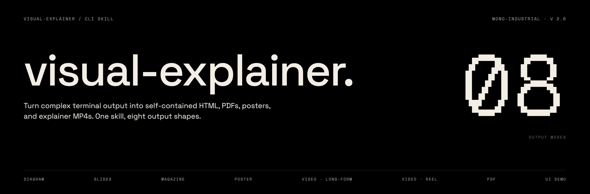
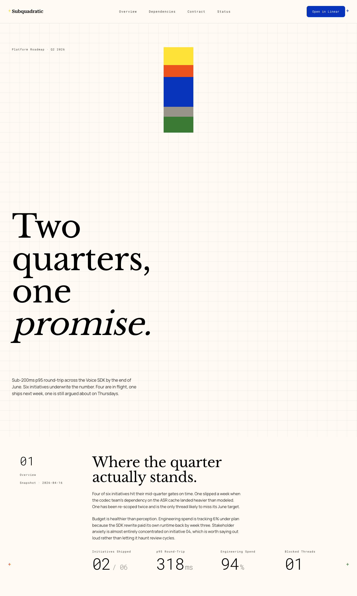
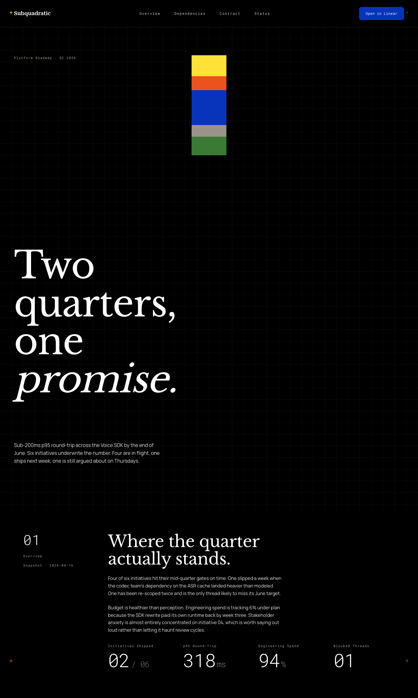
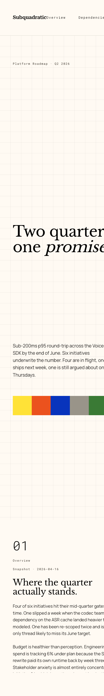

<p>
  
</p>

# visual-explainer-custom

**A Subquadratic-flavored fork of [nicobailon/visual-explainer](https://github.com/nicobailon/visual-explainer).** Same core idea — turn complex terminal output into self-contained HTML pages your agent can hand off — with an opt-in SubQ brand theme, a terminal-dark code block treatment for Mono-Industrial, and an inline UI-demo capture workflow.

[](LICENSE)

Ask your agent to explain a system architecture, review a diff, or compare requirements against a plan. Instead of ASCII art and box-drawing tables, it generates a self-contained HTML page and opens it in your browser.

```
> draw a diagram of our authentication flow
> /visual-explainer:diff-review
> /visual-explainer:plan-review ~/docs/refactor-plan.md
> generate this as subq
```

https://github.com/user-attachments/assets/55ebc81b-8732-40f6-a4b1-7c3781aa96ec

## What's different in this fork

Three additions on top of the upstream skill. Everything else behaves the same — Mono-Industrial is still the default aesthetic, every existing command still works.

### 1. SubQ brand theme

A named alternative aesthetic for pages that need to live inside Subquadratic surfaces. Serif display (Libre Baskerville) + sans body (Manrope) + monospace labels (Roboto Mono) + Roboto Serif Semi-Bold wordmark. Pixel-block accent system, cross-mark corner anchors, 40px grid texture on hero, ghost wordmark footer. Full light / dark / auto support.

<p align="center">
  
  <br>
  <em>Light mode: cream canvas, black contrast panel, blue CTA. Theme toggle at top-right (collapsed on hover-capable devices).</em>
</p>

<p align="center">
  
  <br>
  <em>Dark mode: same page, same layout, inverted neutrals. Accent palette (yellow / blue / orange / green) stays identical across modes.</em>
</p>

**Triggers.** The agent activates SubQ when you mention "subq", "subquadratic", "the SubQ brand", or "our brand" in a Subquadratic context. Otherwise Mono-Industrial stays the default.

**Theme toggle.** Every SubQ page ships with a three-option selector (`○ Light · ● Dark · ◐ Auto`) floating at the top-right. Choice persists to `localStorage`. On hover-capable devices the pill collapses to just the glyphs and unfurls on hover; touch devices stay fully labeled by default. Mermaid diagrams re-render in the new palette on every flip.

See [`plugins/visual-explainer/references/subq.md`](plugins/visual-explainer/references/subq.md) for the full design system (palette with verified hex codes, strict numeric rule, cross-mark + pixel-block motifs, Mermaid theming, pre-render gate) and [`plugins/visual-explainer/templates/subq.html`](plugins/visual-explainer/templates/subq.html) for the reference implementation.

### 2. Terminal code blocks for Mono-Industrial

Every code block on a Mono-Industrial page now renders as a dark terminal pane regardless of whether the page itself is in light or dark mode, with Prism.js syntax highlighting. The token palette uses only the existing status variables — `--warn` (amber) for strings and numbers, `--err` (red) for tags and deletions, `--ok` (green) for diff insertions, plus three opacity tiers of `--fg` for everything else. No new colors.

The one place in the aesthetic that intentionally breaks the grayscale rule. Rationale: code is already its own language with its own visual conventions, and a dark terminal block reads as *this is executable material* in a way a warm-cream block never will.

See [`plugins/visual-explainer/references/libraries.md`](plugins/visual-explainer/references/libraries.md#prismjs--syntax-highlighting) § Prism.js for the full CSS.

### 3. Recorded UI demos, self-contained

New capture workflow for explaining running UI features. Playwright MCP takes screenshots at each beat, `scripts/frames-to-webm.sh` stitches them into a VP9 webm via ffmpeg, and `scripts/embed-media.sh` emits a paste-ready `<video>` tag with the webm base64-inlined. The HTML file stays self-contained.

```bash
# After capturing frames via Playwright MCP → ~/.agent/diagrams/<slug>/
bash plugins/visual-explainer/scripts/frames-to-webm.sh \
  ~/.agent/diagrams/<slug> \
  ~/.agent/diagrams/<slug>.webm \
  2   # fps — 2 for UI demos

bash plugins/visual-explainer/scripts/embed-media.sh \
  ~/.agent/diagrams/<slug>.webm "demo alt text" > snippet.html
```

`embed-media.sh` handles any media type (png/jpg/gif/webp/webm/mp4) and warns on stderr when the file will base64-inflate past 2MB. See [`plugins/visual-explainer/references/demo-capture.md`](plugins/visual-explainer/references/demo-capture.md) for the full pattern, including `agent-browser`-based capture as an alternate path.

## Why

Every coding agent defaults to ASCII art when you ask for a diagram. Box-drawing characters, monospace alignment hacks, text arrows. It works for trivial cases, but anything beyond a 3-box flowchart turns into an unreadable mess.

Tables are worse. Ask the agent to compare 15 requirements against a plan and you get a wall of pipes and dashes that wraps and breaks in the terminal. The data is there but it's painful to read.

This skill fixes that. Real typography, dark/light themes, interactive Mermaid diagrams with zoom and pan. No build step, no dependencies beyond a browser.

## Install

**Claude Code (from this fork):**

```bash
git clone https://github.com/theclaymethod/visual-explainer-custom.git
# Link into ~/.claude/plugins or install via /plugin marketplace add <path>
```

**Pi / OpenAI Codex:** same steps as upstream, point at this repo:

```bash
git clone --depth 1 https://github.com/theclaymethod/visual-explainer-custom.git /tmp/ve
cp -r /tmp/ve/plugins/visual-explainer ~/.agents/skills/visual-explainer
rm -rf /tmp/ve
```

If you want the upstream (non-SubQ) version instead, see [nicobailon/visual-explainer](https://github.com/nicobailon/visual-explainer).

## Commands

| Command | What it does |
|---------|-------------|
| `/generate-web-diagram` | Generate an HTML diagram for any topic |
| `/generate-visual-plan` | Generate a visual implementation plan for a feature or extension |
| `/generate-slides` | Generate a magazine-quality slide deck |
| `/generate-poster` | Generate a single-canvas poster via poster-ai |
| `/diff-review` | Visual diff review with architecture comparison and code review |
| `/plan-review` | Compare a plan against the codebase with risk assessment |
| `/project-recap` | Mental model snapshot for context-switching back to a project |
| `/fact-check` | Verify accuracy of a document against actual code |
| `/share` | Deploy an HTML page to Vercel and get a live URL |

The agent also kicks in automatically when it's about to dump a complex table in the terminal (4+ rows or 3+ columns) — it renders HTML instead.

## Aesthetics

Mono-Industrial is the default. Named alternatives are opt-in — the agent only selects them when you explicitly ask.

| Aesthetic | Trigger | Reference |
|---|---|---|
| **Mono-Industrial** *(default)* | Every generation unless named otherwise | [`references/mono-industrial.md`](plugins/visual-explainer/references/mono-industrial.md) |
| **SubQ / Subquadratic** | "subq", "subquadratic", "our brand" in Subquadratic context | [`references/subq.md`](plugins/visual-explainer/references/subq.md) |
| Blueprint | "use Blueprint style" | legacy |
| Editorial | "use Editorial style" | legacy |
| Paper/ink | "use paper/ink style" | legacy |
| Monochrome terminal | "use terminal style" | legacy |
| IDE-inspired | "use Dracula palette", "Catppuccin", etc. | legacy |

## Slide Deck Mode

Any command that produces a scrollable page supports `--slides` to generate a slide deck instead:

```
/diff-review --slides
/project-recap --slides 2w
```

https://github.com/user-attachments/assets/342d3558-5fcf-4fb2-bc03-f0dd5b9e35dc

## How It Works

```
.claude-plugin/
├── plugin.json
└── marketplace.json
plugins/
└── visual-explainer/
    ├── .claude-plugin/plugin.json
    ├── SKILL.md                      ← workflow + design principles
    ├── commands/                     ← slash commands
    ├── references/
    │   ├── mono-industrial.md        ← default aesthetic
    │   ├── subq.md                   ← SubQ brand (this fork)
    │   ├── css-patterns.md           ← layouts, animations, theming
    │   ├── libraries.md              ← Mermaid, Chart.js, Prism.js, fonts
    │   ├── demo-capture.md           ← UI demo → webm workflow (this fork)
    │   ├── poster.md                 ← fixed-canvas output via poster-ai
    │   ├── responsive-nav.md         ← sticky TOC for multi-section pages
    │   ├── slide-patterns.md         ← slide engine, transitions, presets
    │   └── …
    ├── templates/
    │   ├── mono-industrial.html      ← default scrollable
    │   ├── mono-industrial-slides.html
    │   ├── subq.html                 ← SubQ reference (this fork)
    │   ├── architecture.html         ← legacy
    │   ├── mermaid-flowchart.html
    │   ├── data-table.html
    │   └── slide-deck.html
    └── scripts/
        ├── share.sh                  ← deploy HTML to Vercel
        ├── frames-to-webm.sh         ← PNG frames → webm (this fork)
        └── embed-media.sh            ← media → base64 inline snippet (this fork)
```

**Output:** `~/.agent/diagrams/filename.html` → opens in browser.

The skill routes to the right approach automatically: Mermaid for flowcharts, CSS Grid for architecture overviews, HTML tables for data, Chart.js for dashboards.

## Responsive

Every template adapts from 1440px+ desktop down to 390px mobile. The SubQ theme's toggle shifts from top-right pill to bottom-right thumb zone to full-width bottom bar at the 768px and 420px breakpoints.

<p align="center">
  
  <br>
  <em>SubQ on a 390px viewport. Cross marks hide below 768px, the toggle drops to a thumb-zone pill, and the hero's pixel column rotates horizontal.</em>
</p>

## Limitations

- Requires a browser to view
- Mermaid SVGs re-render when the SubQ theme toggle flips, but stock Mono-Industrial diagrams still need a page refresh when OS theme changes
- Results vary by model capability
- Demo capture requires `ffmpeg` (always) plus either Playwright MCP or `agent-browser` (either one works)

## Credits

Based on [nicobailon/visual-explainer](https://github.com/nicobailon/visual-explainer). Borrows ideas from [Anthropic's frontend-design skill](https://github.com/anthropics/skills) and [interface-design](https://github.com/Dammyjay93/interface-design).

SubQ brand system extracted from Subquadratic's internal V6 brand exploration deck.

## License

MIT
